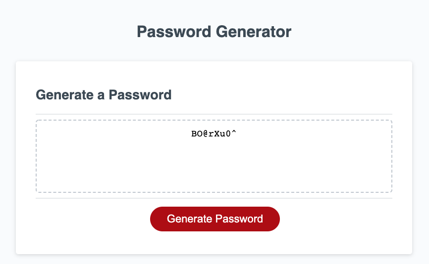

# Columbia University Bootcamp Week 2 Homework: Porfolio

## Introduction
This repo is my third homework for my Columbia Bootcamp. I completed the following:
1. I finished the starter js code so that users can generate a password.
2. I used window prompts to get user input on password criteria/
3. I used the Math.random method to generate a random character for the password generation.

Screenshot:

## Technology
* HTML
* CSS
* JS

## Link to Deployed Site
https://byung90.github.io/columbia-week3-homework/

## License
[MIT](https://choosealicense.com/licenses/mit/)